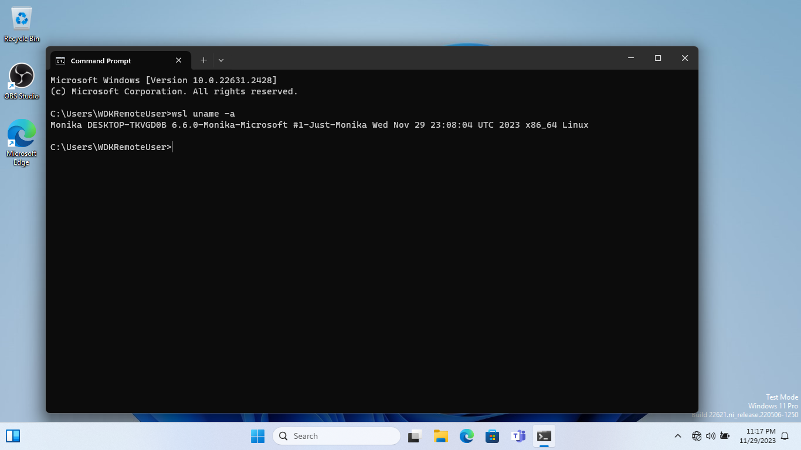

# lxmonika

[](https://discord.gg/bcV3gXGtsJ)

A Windows driver to monitor kernel access of Pico processes.

## Current functionality

`lxmonika` intercepts every Pico provider callbacks and forwards the calls to `lxcore`.

If `lxmonika` encounters any WSL1 process making the `uname` syscall, it will modify the returned
structure. Specifically:

- `sysname` will become `Monika` (instead of `Linux`).
- `release` will be the latest LTS release of the Linux kernel (currently `6.6.0`).
- `version` will be the build version of `lxmonika` instead of a hard-coded string defined by
`lxcore`.

`lxmonika` currently does not modify any other interactions of WSL1 processes with the kernel.



## How it works

`lxmonika` first locates `ntoskrnl.exe` (the NT kernel image) and the `lxcore.sys` driver in
memory.

Then, it uses heuristics to locate `PspPicoProviderRoutines`, a structure containing functions
the NT kernel will call whenever a WSL1 process makes interactions with the kernel, such as
performing a `syscall`.

`lxmonika` then detects the `syscall` number, looks for `uname`, and modifies the return values.

## Potential applications

While intercepting `uname` to bump up the kernel version without adding any features does not
seem useful (other than for showing off with `neofetch`), being able to intercept all WSL1
processes has huge implications.

Since Microsoft no longer supports WSL1 (The
["WSL1"](https://github.com/microsoft/WSL/issues?q=is%3Aopen+is%3Aissue+label%3Awsl1) label on
their tracker repo basically means "wontfix", based on the fact that only 11 out of more than 100
issues are closed, and some closed issues are marked "fixed-in-WSL2"), being able to intercept
syscalls means that third-party kernel drivers can potentially deliver their own fixes, given
enough knowledge about the NT kernel internals.

It is also possible for open-source projects to port the whole Linux kernel as a Windows driver,
creating a more modern version of [coLinux](http://www.colinux.org/) with 64-bit support and
better integration.

Finally, since Pico processes are not restricted to Linux, we can implement other kernels'
ABIs, such as Darwin. An idea is to implement a special device to handle `ioctl`s using APIs
exposed by [lxdk](https://github.com/billziss-gh/lxdk). After Microsoft's `init` is called,
a special ELF binary can notify Monika using that device and `ioctl` to switch to Darwin mode,
then give control to `launchd`.

<!-- HyClone on Windows when? -->

## Build instructions

### Prerequisites

- Visual Studio 2022.
- The latest WDK. Download it
[here](https://learn.microsoft.com/en-us/windows-hardware/drivers/download-the-wdk).
- A Windows NT 10.0 machine with Test Signing enabled.

### Instructions

Use whatever workflow you normally use for your kernel drivers. The steps below are my preferred
procedure and friendly for KMDF newbies.

#### For the first time you deploy a driver on a new computer

On an elevated Command Prompt window on the test computer:

- Enable test signing.
```bat
bcdedit /set testsigning on
```
- Copy the
[`devcon.exe`](https://learn.microsoft.com/en-us/windows-hardware/drivers/devtest/devcon)
tool to the test computer. It is normally located at
`%PROGRAMFILES(x86)%\Windows Kits\10\Tools\$(WINDOWS_SDK_VERSION)\$(ARCHITECTURE)\devcon.exe`.
- Reboot the device.
```bat
shutdown /r /t 00
```

#### Every time you want to test

- Build this driver on Visual Studio 2022 (Right-click the project -> Build).
- Copy the output folder, located at
`$(SolutionDir)\lxmonika\bin\$(Configuration)\$(Platform)\lxmonika`, to the test device.

On an elevated Command Prompt window on the test computer:

- Run the command below. Replace the `path\to` part with the relevant paths. `Root\lxmonika` is the
driver's virtual device path and should stay the same for all command invocations.
```bat
path\to\devcon.exe install path\to\lxmonika\lxmonika.inf Root\lxmonika
```
- Reboot the device.
```bat
shutdown /r /t 00
```

### Notes

For the latest Windows builds, WinDbg and Debug mode may not be required, since PatchGuard might
have removed `PspPicoProviderRoutines` from its	`PsKernelRangeList`. Therefore, modifying the
structure may not cause the BSOD anymore.

The driver has only been tested on Windows build 22621 (Windows 11 23H2). For other Windows builds,
YMMV.

Only `x86_64` is currently supported; the Pico structs have not been tested for `arm64` Windows
yet, as I do not own an `arm64` Windows device.

## Future plans

- [**DONE**] Fetch `LxpRoutines` from `lxcore.sys`. These are essential routines any pico provider
would need to manage its processes. Normally, the struct would be returned by
`PsRegisterPicoProvider`; however this function has already been locked down by Microsoft using a
boolean guard (`PspPicoRegistrationDisabled`).
- [**DONE**] Create a `MaRegisterPicoProvider` and let `lxmonika` manage these providers instead.
Even if we override the boolean guard, `PsRegisterPicoProvider` would not correctly handle multiple
Pico drivers, since `PspPicoProviderRoutines` is not an array or table but just a global variable.
- Provide a sample Pico provider.
- (Far, far future) Port a newer version of Linux, Darwin, or even Haiku???
- (Far, far future) Revive project Astoria???

## Community

This repo is a part of [Project Reality](https://discord.gg/bcV3gXGtsJ).

Need help using this project? Join me on [Discord](https://discord.gg/bcV3gXGtsJ), and let's find a
solution together.

## Acknowledements

Thanks to Martin Hron ([**@thinkcz**](https://github.com/thinkcz)) for his
[pico-toolbox](https://github.com/thinkcz/pico-toolbox), which provides the required definitions
and a proof-of-concept for Pico process hacking.

Thanks to Bill Zissimopoulos ([**@billziss-gh**](https://github.com/billziss-gh)) for his
[lxdk](https://github.com/billziss-gh/lxdk), which documents the various symbols exposed by
`lxcore`, enabling the functionality of `/dev/reality`. Unfortunately, due to licensing issues,
his great project cannot be directly incorporated into `lxmonika`.

## Suggested readings

- Microsoft's
[Pico Process Overview](https://learn.microsoft.com/en-us/archive/blogs/wsl/pico-process-overview).
- Windows Internals 7th Edition, Part 1, Pages 68-70, 121-124.
- [The Linux kernel hidden inside Windows 10](https://github.com/ionescu007/lxss/blob/master/The%20Linux%20kernel%20hidden%20inside%20windows%2010.pdf)
by Alex Ionescu ([**@ionescu007**](https://github.com/ionescu007)).
- [Write a Hello World Windows Driver (KMDF)](https://learn.microsoft.com/en-us/windows-hardware/drivers/gettingstarted/writing-a-very-small-kmdf--driver).
Highly recomended if you are new to Windows driver development like me.
